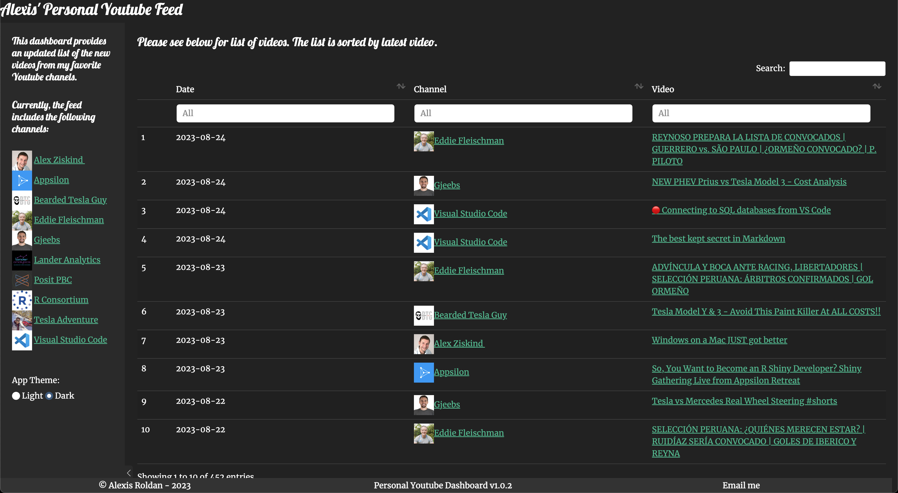
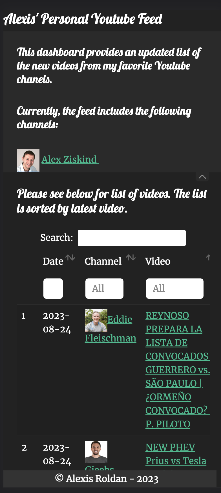

# Personal Youtube Feed Dashboard

**IMPORTANT:**
<br>
**Before cloning this repo and running the logic, please make sure to have a *Youtube API Key* and *AWS Secrets*.**

# Overview
Interactive Youtube feed app developed using R/Shiny to show my daily Youtube feed. This personal dashboard refresh data daily.

## Preview - Full Window
<!--  -->
Please see below for screenshot of app web version.



## Preview - Mobile Version
Screenshot below show app mobile version.
<br>
<br>


## Configuration
Create a `.Renviron` file and store your **Youtube & AWS Keys.**
```shell
api_key <- <Your API Key>
```
